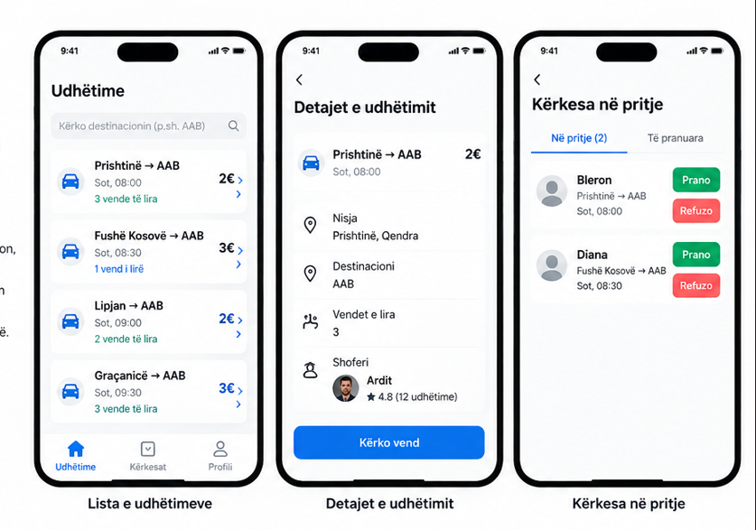

# RideShare — Java 2

### 1. Problemi
Studentët që udhëtojnë për në AAB shpesh kanë probleme me transportin. Ndonjëherë është e vështirë të gjejnë transport të lirë dhe në kohë.

### 2. Përdoruesit
Shoferi dëshiron të ndajë vendet e lira në veturë me studentët e tjerë. Udhëtari dëshiron të gjejë transport të lirë dhe të shpejtë për në AAB.

### 3. Tri ekranet
- **Lista e udhëtimeve:** Shfaq udhëtimet e disponueshme, orën dhe vendet e lira.
- **Detajet e udhëtimit:** Shfaq shoferin, vendin e nisjes, çmimin dhe mundësinë për të kërkuar vend.
- **Kërkesa në pritje:** Shfaq kërkesat që shoferi mund t'i pranojë ose refuzojë.

### 4. MVP — vetëm tri veçori
1. Shoferi mund të krijojë një udhëtim.
2. Udhëtari mund të kërkojë një vend në udhëtim.
3. Shoferi mund të pranojë ose refuzojë kërkesën.

### 5. Çfarë e lëmë për më vonë?
- Pagesat online.
- Komunikimin me mesazhe mes shoferit dhe udhëtarit.

### 6. Si e provoj?
Kur kërkoj një vend, kërkesa duhet t'i shfaqet shoferit për pranim. Nëse nuk ka vende të lira, shfaqet një mesazh që udhëtimi është i mbushur.

### 7. Prova me kolegun
Kolegu nuk e kuptoi menjëherë ku duhet të klikojë për të kërkuar vend. E bëra butonin më të madh dhe më të dukshëm.

### 8. Ndihma nga AI
Përdora AI për ide rreth organizimit të aplikacionit dhe tri ekraneve kryesore. Përgjigjet i kontrollova dhe i përshtata sipas kërkesave të detyrës.

